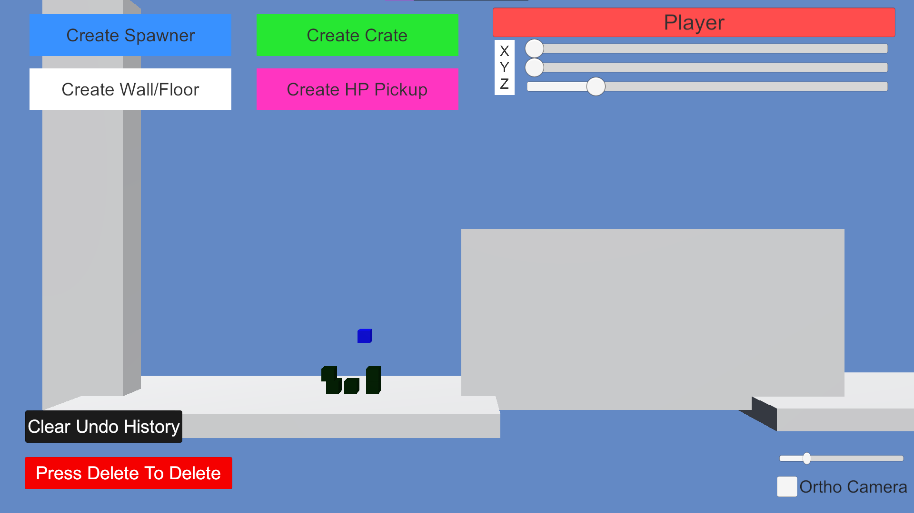
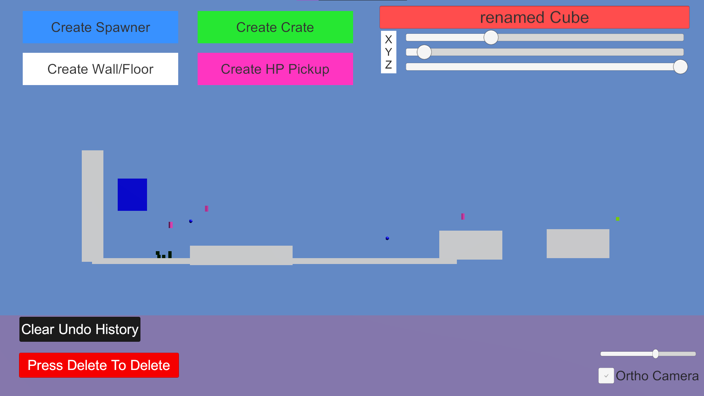
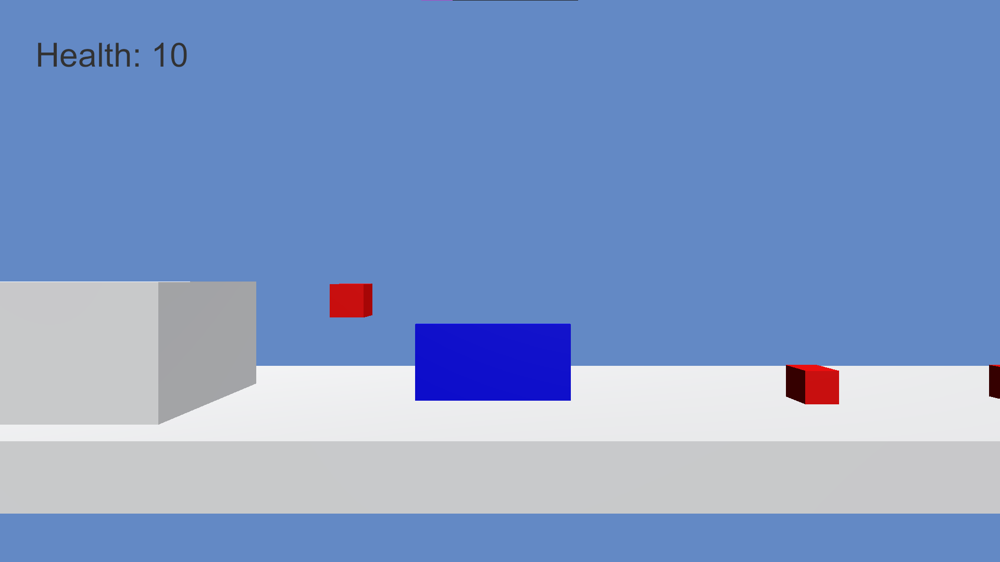
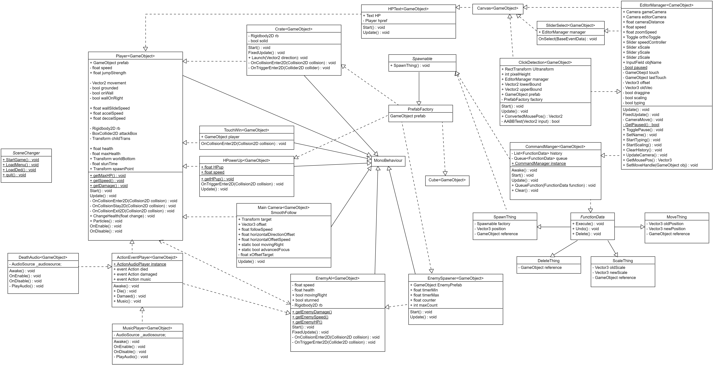

Engines Assignment 3

**Assignment 2 was used as a base

Description:

This game is a 2.5D platforming game. The player can move jump, attack and wall jump in order to fight enemies and reach the goal block at the end of the stage. In the level editor, the user gains control of anything that has a hitbox, aka everything. they can move them, scale them and even delete them (no deleting the player though). The editor trakcs these changes and allows for undoing and redoing them. they can access this by jsut pausing the game (pressing P), this will pause physics, so do be wary of the players velocity when pausing.

By: Matthew McPherson (100757379)

Video Link: https://www.youtube.com/watch?v=gTfReEADvTM

Screenshots and UML:

Normal UI  

UI after some changes  

Changes in game  

UML:  

Main Controls:  
WASD or Arrows to move  
Space to jump  
E or Right Shift to attack

P to toggle between modes

Editor Controls:  
Left Click to select  
Drag on selected to move  
Drag scale sliders to scale object  
----Right Click to confirm scale  
Delete to delete selected object  
Rename objects by clicking in the name box in the top right  
Undo with Z, redo with R

To mod the game, grab the dll wanted from teh DLLs folder and paste it into the plugins folder of Unity, then rename it ModDLL.dll

Design patterns implemented:  
Singleton in the event and command managers  
Observer using C# events  
Command using the FunctionData interface as base  
Factory using the Spawnable interface as base
Dirty Flag is used to decide wheather or not to animate the HP-Pickup

The base code was from assignment 2 and any new additions for assignment 3 were by Matthew McPherson

Assisted by Tutorial code for Observer, Command, Singleton and dirty flag design patterns  
The music is from: https://www.youtube.com/watch?v=ol_dtjH-ino  
And the "Oof" sound is from roblox;
